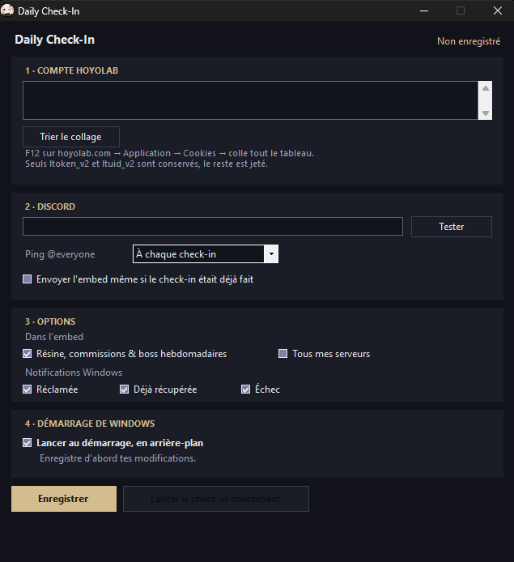
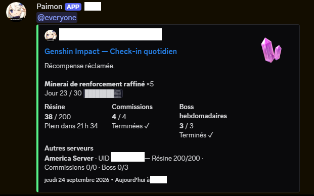

<div align="center">

# Daily Check-In 🔴

**`Status: Operational`** | **`Version: 1.0.0`**
<br>
*Automated HoYoLAB daily check-in with Discord webhook sender for notifications. Zero dependencies, 164 KB.*


</div>

---

### > ABOUT

Automates your daily HoYoLAB check-in on Windows boot without background overhead.
Sends detailed Discord webhook embeds tracking real-time resin timers, daily commissions, weekly bosses status, and claimed rewards.
Packed into a single 164 KB standalone executable with zero runtime dependencies.

---

### > PREVIEW

<div align="center">
  <table>
    <tr>
      <td width="48%" align="center" valign="top">
        <sub><b>GUI Configuration</b></sub><br><br>
        
      </td>
      <td width="52%" align="center" valign="top">
        <sub><b>Discord Notification Embed</b></sub><br><br>
        
      </td>
    </tr>
  </table>
</div>

---

### > BUILT WITH


---

### > GETTING STARTED

> **`[ 1 . I N S T A L L A T I O N ]`**
```bash
git clone https://github.com/N4SSDev/HoYoLAB-Daily-Check-In.git
```

Build using Windows' native `csc.exe` (no SDK required) :

```powershell
powershell -ExecutionPolicy Bypass -File .\build.ps1
```
Output: `out\DailyCheckIn.exe`.

> **`[ 2 . E X E C U T I O N ]`**
```bash
.\out\DailyCheckIn.exe
```

> The pre-compiled standalone executable is available in the **[Releases](../../releases)**.

---

### > LINKS

[](https://discord.gg/B5jzC9kdv4)
[](https://github.com/N4SSDev)
